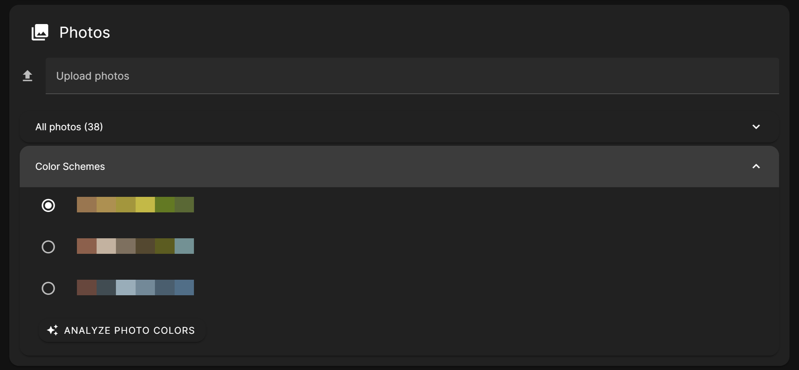
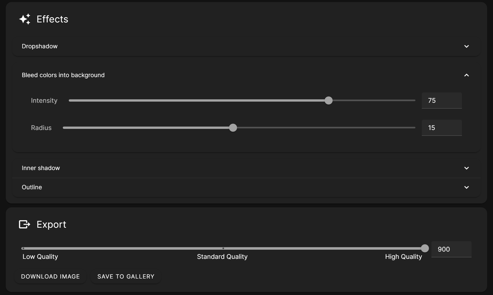
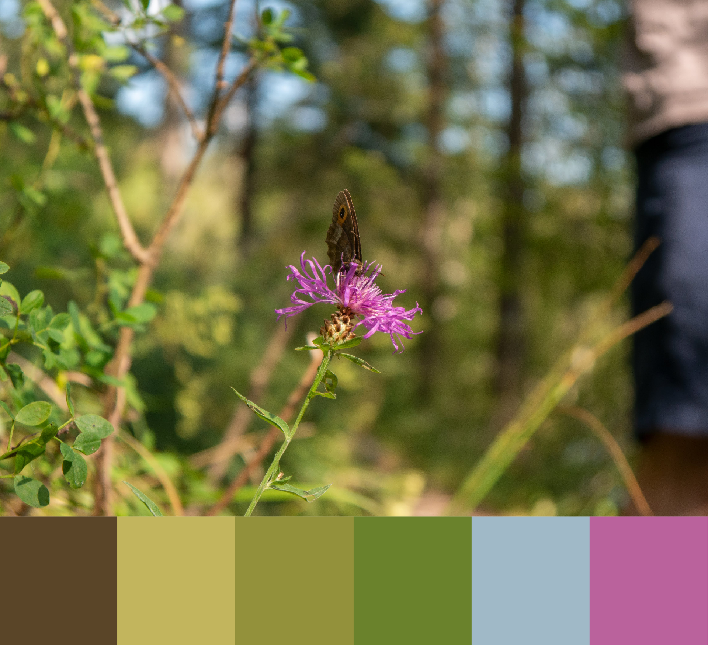
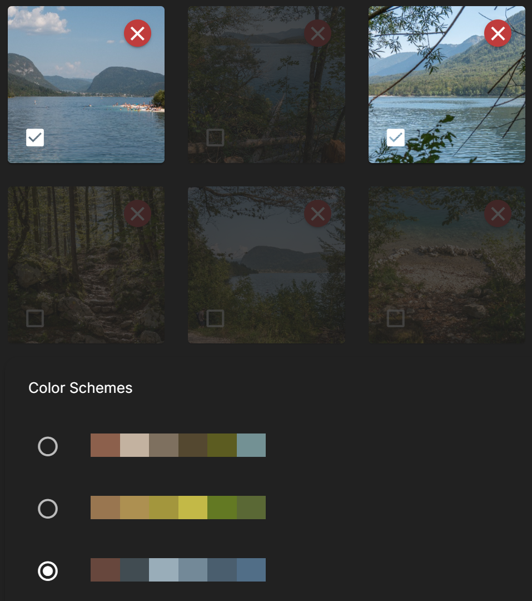
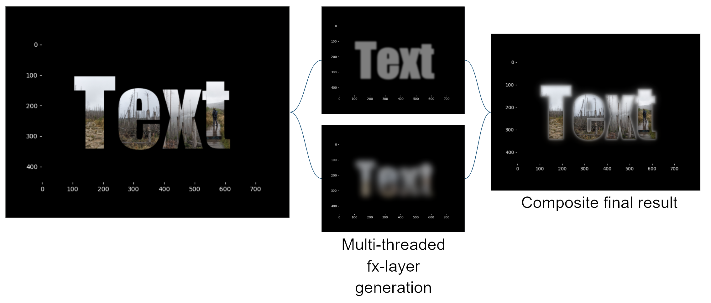
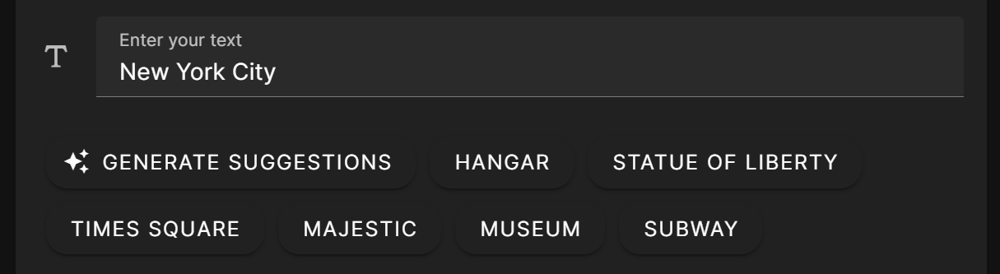

# Artistic Cover Letter

<picture>
   <source media="(prefers-color-scheme: dark)" srcset="readme_img/demo1_dark.png">
   <source media="(prefers-color-scheme: light)" srcset="readme_img/demo1_light.png">
   
</picture>

This software lets users easily generate combinations of letters and images.

## Text & Font options

<picture>
   <source media="(prefers-color-scheme: dark)" srcset="readme_img/demo2_dark.png">
   <source media="(prefers-color-scheme: light)" srcset="readme_img/demo2_light.png">
   
</picture>

## Photos and generated color schemes

<picture>
   <source media="(prefers-color-scheme: dark)" srcset="readme_img/demo3_dark.png">
   <source media="(prefers-color-scheme: light)" srcset="readme_img/demo3_light.png">
   
</picture>

## Effects & Export

<picture>
   <source media="(prefers-color-scheme: dark)" srcset="readme_img/demo4_dark.png">
   <source media="(prefers-color-scheme: light)" srcset="readme_img/demo4_light.png">
   
</picture>

# Relevant concepts

 

Color extraction using an algorithm by [Kamal Joshi](https://hackernoon.com/extract-prominent-colors-from-an-image-using-machine-learning-vy2w33rx).

Including Oklab color space to improve perceptual uniformity, with primitive clustering to find photos with similar color schemes.

Previous attempts included hue matching with histogram analysis, and random color scheme generation using Oklab inspired by [Acerola](https://youtu.be/fv-wlo8yVhk?si=vvBKAdjNrrfGk45I&t=1673).

<picture>
   <source media="(prefers-color-scheme: dark)" srcset="readme_img/demo7_dark.png">
   <source media="(prefers-color-scheme: light)" srcset="readme_img/demo7_light.png">
   
</picture>



Layer system using a cached base layer to efficiently generate effects, including DPI-based settings to adjust rendering resolution.

<picture>
   <source media="(prefers-color-scheme: dark)" srcset="readme_img/demo9_dark.png">
   <source media="(prefers-color-scheme: light)" srcset="readme_img/demo9_light.png">
   
</picture>

Moondream AI model for Text suggestions.

<picture>
   <source media="(prefers-color-scheme: dark)" srcset="readme_img/output_video_dark.avif">
   <source media="(prefers-color-scheme: light)" srcset="readme_img/output_video_light.avif">
   
</picture>

Proof of concept animation rendering.

# Setup

This project utilizes the moondream AI model, which is licensed under the Apache 2.0 license. See the LICENSE file for more information.

## Prerequisites

- **Node.js** (for the frontend) - [Download here](https://nodejs.org/en/download/)
- **Python 3.10+** (for the backend) - [Download here](https://www.python.org/downloads/)
- **Conda** (for environment management) - [Install here](https://docs.conda.io/projects/conda/en/latest/user-guide/install/)

---

### 1. Backend Setup

1. **Navigate to the backend folder:**
   ```sh
   cd backend
   ```

2. **Set up the Python environment:**
   If you're using Conda, create and activate the environment:
   ```sh
   conda create --name simple-webapp python=3.10
   conda activate simple-webapp
   ```

3. **Install dependencies:**
   ```sh
   pip install -r requirements.txt
   ```

4. **Run the backend server:**
   ```sh
   cd src
   python main.py
   ```

   Your backend should now be running at `http://localhost:8000`.

---

### 2. Frontend Setup

1. **Navigate to the frontend folder:**
   ```sh
   cd frontend
   ```

2. **Install the dependencies:**
   ```sh
   npm install
   ```

3. **Execute ```run.bat``` or start the development server manually:**
   ```sh
   npm run dev
   ```

   Your frontend should now be running at `http://localhost:[PORT]`.

---

## Useful links
- **Vue3 Introduction:** https://vuejs.org/guide/introduction.html
- **Vuetify Documentation:** https://vuetifyjs.com/en/components/buttons/#usage
- **FastAPI Examples:** https://fastapi.tiangolo.com/tutorial/first-steps/